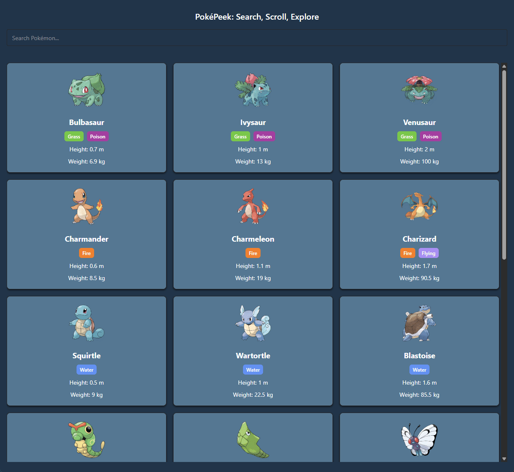

# Pokemon Search tool with React Query

A responsive React + TypeScript web app for browsing and filtering a comprehensive list of  Pokémon. This project showcases practical usage of modern React tooling including

## ✨ Purpose

This project was built to practice and demonstrate:

- **API data fetching & caching** with React Query
- **Efficient filtering/search** using controlled inputs and lifted state
- **Responsive, accessible UI** using Chakra UI components
- **Infinite scrolling** for performant handling of large lists
- **Clean state management** without external state libraries
- Structuring a React app for **scalability and readability**
- **useMemo** for memoization to prevent unnecessary re-renders

## ✨ Tech Stack

- **React** (with TypeScript)
- **TanStack React Query** (v5)
- **Chakra UI** (v3.x)
- **Axios** 
- **Vite** (for fast local dev and build)
- **PokéAPI** (for live data)

## ✨ Features

- Full list of all Pokémon fetched and cached via React Query
- Search bar with real-time filtering
- Responsive grid layout using Chakra's `SimpleGrid`
- Smooth loading and error states
- Infinite scrolling
- Styled Pokémon "cards" with hover interactions

## 🌱 DEMO

[Live demo site on Vercel](https://pokemon-search-tool.vercel.app/)

